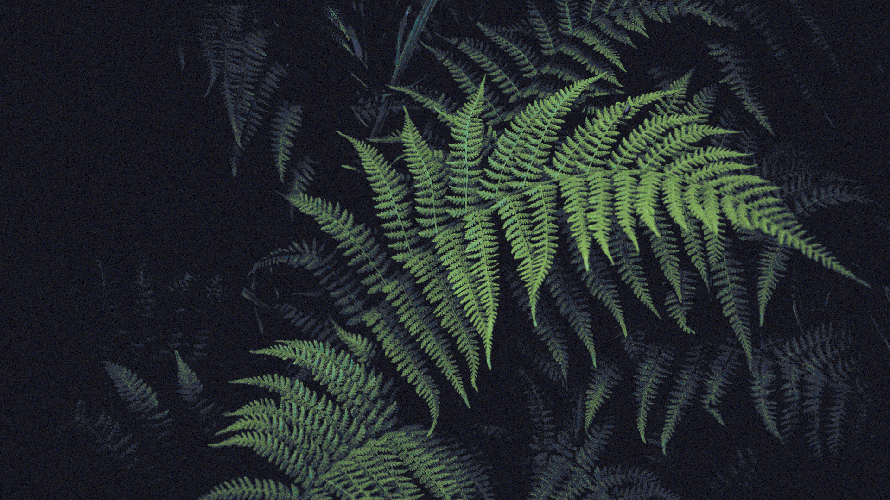
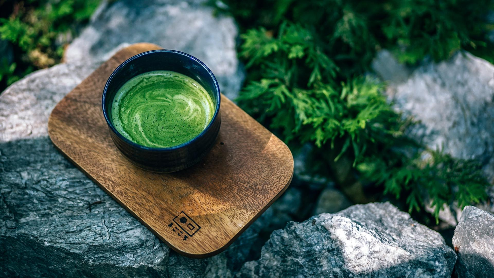
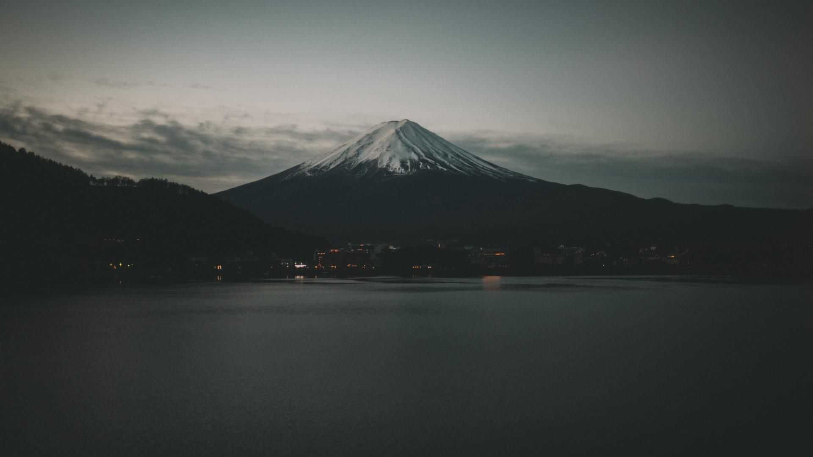
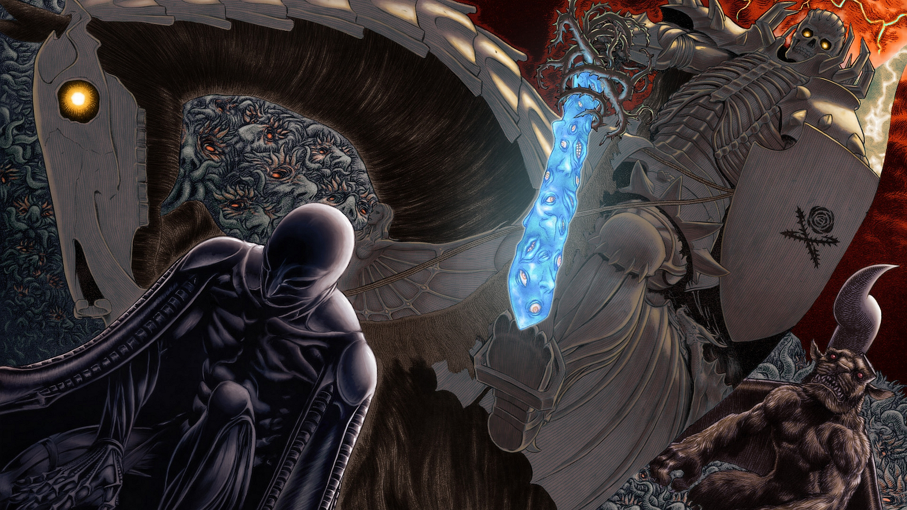
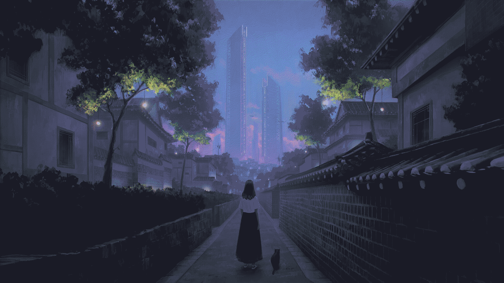
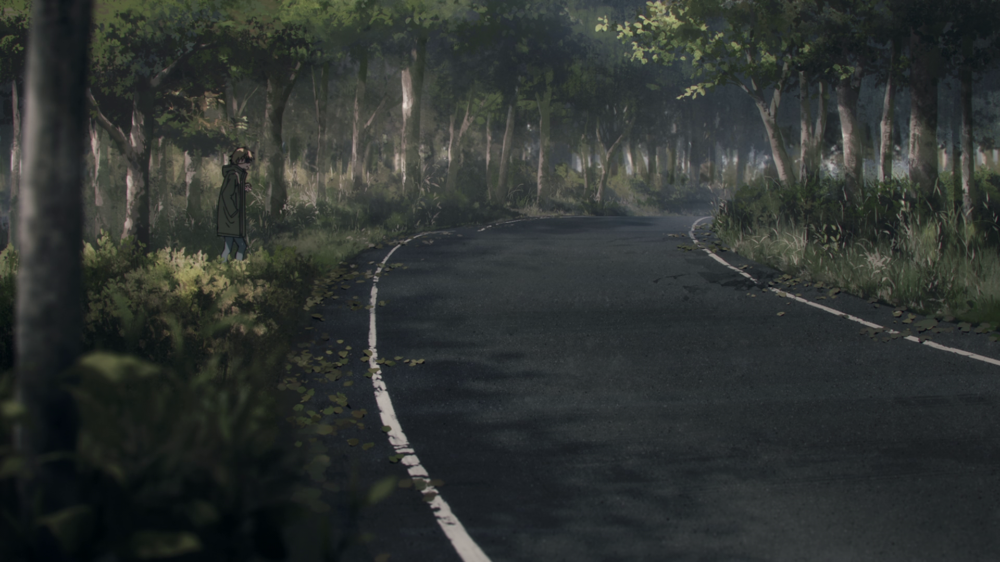
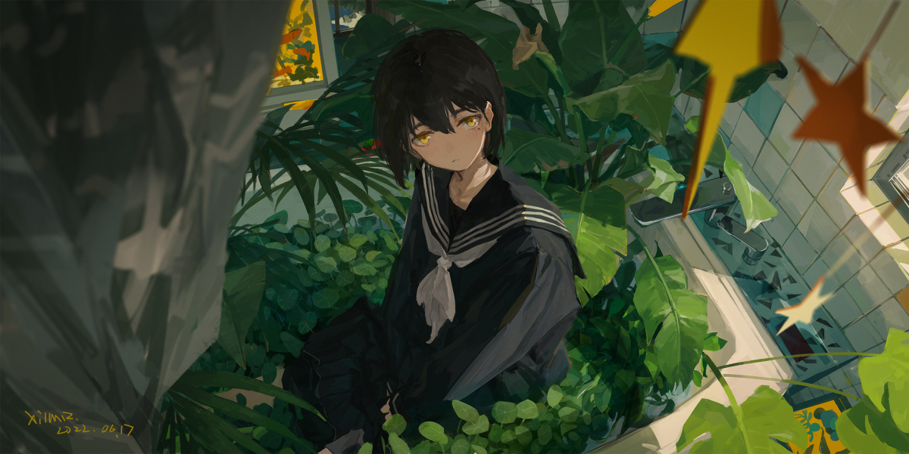
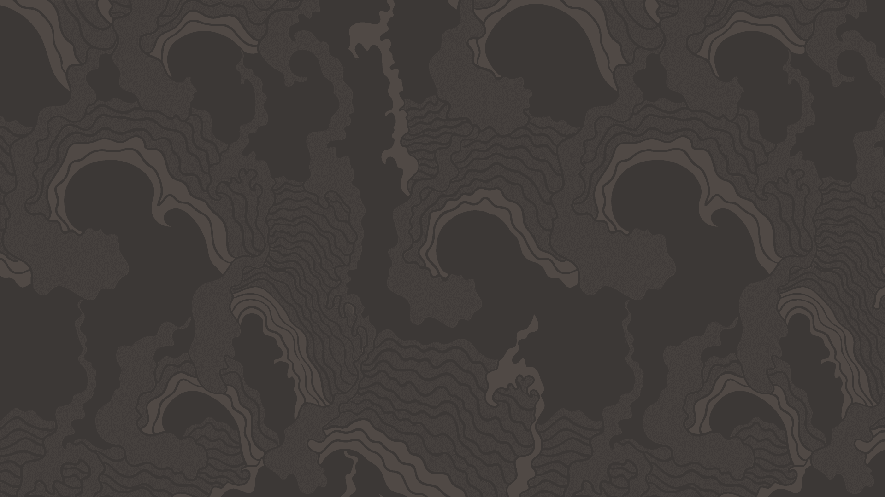
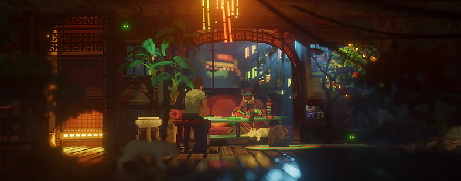

# :art: Some wallpapers in 1920x1080 pixels 

 

## :leaves: Some nature wallpapers

## :sushi: Some anime wallpapers

## :grey_question: Some abstract wallpapers

## :video_game: Some video-games wallpapers

